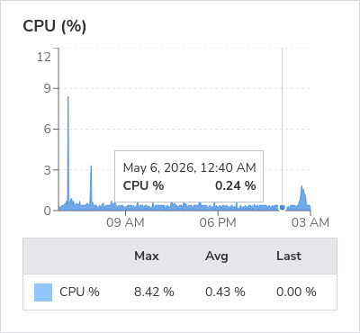
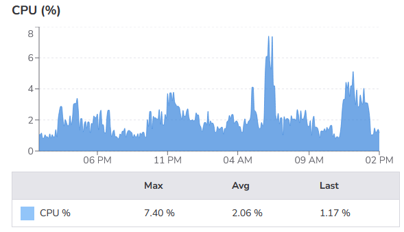

# Making of (this site)

I want to host some static blog-like content, and be _as simple as possible_ to maintain and publish. I'm not a web developer, and anything that takes mental effort on top of writing is a bridge too far, for now at least.

<!-- more -->

# Tech stack
### Background
I'm approximately a backend developer or a data scientist or a machine learning engineer depending on the week. I like tmux, vim, markdown files, and ssh-ing into things. I don't like JavaScript. Since this is for fun I will lean into my comfort zone.

### Static generation 
The only real option as far as I'm aware for avoiding all the web dev stuff. I mean, I could use some platform like 
[Mataroa](https://mataroa.blog/) but I couldn't possibly give up the control. Besides self hosting is fun, right? ...right?

I do find [a pure HTML approach](https://davidlowryduda.com/static/simplemathpage.html) inspiringly minimalist, but I need to avoid HTML for my ego.

While procrastinating[^1] the writing and actual work, I researched some options:

- Hugo
- Jekyll
- Franklin? (Big Julia fan)

And then, finally, I started playing with `mkdocs` at work. Wow is that simple! And it has a bunch of nice themes. Enough procrastinating, I'll roll with this until something shinier comes along.

### Source control
[git, obviously.](https://github.com/Jacob-harris-94/blog)

### Domain
I've had `nerdsquad.xyz` for a while, so I'll just use it. A college buddy put me in his phone address book that way and I'm taking it as a compliment.

### Continuous deployment
Sure I _could_ set up something fancy with GitHub actions, jenkins, who knows what. You know what's reliable and dead simple? `cron`. Well, I haven't actually done it yet, but I assume it'll be easy. ~~TODO~~.

Maybe I'll get even fancier and script building and deploying straight from my Obsidian vault... Even more TODO.
# The end
If you're reading this, it worked! Cheers -- and might I suggest you check back in on an [exponential backoff](https://en.wikipedia.org/wiki/Exponential_backoff). 

# Addendum
### TLS (2026-05-05)
Wow, I can't belive it was this easy and I had put it off. God bless the [EFF](https://www.eff.org/)! I used `snap` to install `certbot` and this was all it took
```bash
sudo snap install --classic certbot
sudo ln -s /snap/bin/certbot /usr/local/bin/certbot
sudo certbot --nginx
# answer default answers to a bunch of prompts
```
I refreshed the site and it worked!

### Continuous deployment (2026-05-22)
I had the unfortunate realization that since I don't want to use an intermediate builder service, I'll have to build it on the host. For security's sake, I'd rather not pull dev dependencies into production. Oh well.

Someone told me it was stupid to waste CPU polling for updates rather than setting up webhooks. To that I say: I'm payging for a dedicated CPU core regardless and my usage looks like this:


/// caption
slight headroom available for "wasting"
///

My next problem is the environment. An LTS so old it's deprecated is not ideal if this has to act as a dev environment too. And probably for other reasons as well. So let's just standardize to run the same thing I run everywhere, Rocky 9. That was easier than I thought, thanks Linode! It was basically one click to "rebuild" the host with my OS of choice.

### Most naive possible Continuous Deployment
I had already created `publish.sh` for convenience
```bash
#!/bin/bash

set -e

pdm run mkdocs build
rm -rf /var/www/nerdsquad.xyz
mv ./site /var/www/nerdsquad.xyz
echo "done!"
```

So now all I need to do is run that every minute by writing `job.sh`:
```bash
#!/bin/bash

set -e  # exit on first error
set -vx # show unexpanded and expanded commands before running

PATH="~/.local/bin:${PATH}"
echo "$pwd"

git pull

# TODO: hash comparison

./publish.sh

echo "done!"
```

and adding a cron job to run it every minute:
```bash
* * * * * cd {location} && ./job.sh &>> {location}/job.log
```

and for the sake of additional automation, let's script adding _that_ to crontab:
```bash
#!/bin/bash

set -e  # exit on first error

WHEN="* * * * *"
CMD="cd $(realpath .) && ./job.sh &>> $(pwd)/job.log"

# below modified from:
# Source - https://stackoverflow.com/a/878647
# Posted by dogbane, modified by community. See post 'Timeline' for change history
# Retrieved 2026-05-19, License - CC BY-SA 3.0

#write out current crontab
crontab -l > mycron
#echo new cron into cron file
echo "${WHEN} ${CMD}" >> mycron
#install new cron file
crontab mycron
rm mycron
```

This works! Next, to not pull and build _every single minute with no exceptions_. 

In my defense, 4% cpu utilizarion for doing this silliness isn't _so bad_. It's not like this is a popular site I need to manage resources for.


/// caption
kinda wastefu rebuilding every minute... but hey I'm paying for a dedicated core, might as well use it...
///


### Less naive Continuous Deployment
I'm still not going to set up a server to listen for webhooks. What would be a big improvement over re-building the site every minute? _Checking_ if the site needs to be rebuilt every minute! Changing `job.sh` to include

```bash
HASH_BEFORE=$(git rev-parse --short HEAD)
git pull
HASH_AFTER=$(git rev-parse --short HEAD)
if [ "$HASH_BEFORE" = "$HASH_AFTER" ]; then
	echo "no change, exiting" && exit 0
fi
```

couldn't be much simpler!

The cpu consumption drops to 2% and with that, i officially deem this good enough!


/// caption
good enough!
///


[^1]: I've had the domain since 2020-06-14, so only about 6 years before finally doing something. 🤷 

