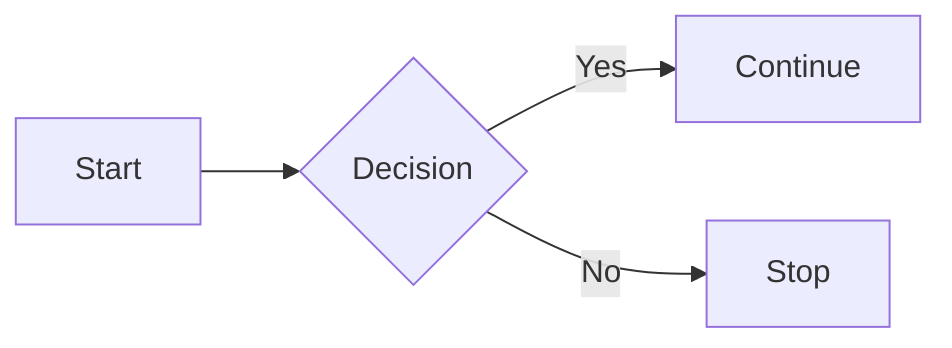

#### Goal
Put a revolving pixel-art image on the github activity visualization - something funny like "made you look! 👀" Or "hire me!".

![[Screenshot_20251224-101428.Firefox.png]]
See very talented artists impression above.

Some people (maybe only in terminally (haha) online dev culture) treat this as some sort of status symbol. Since I can't compete on that front, might as well have fun with it! Its some entertainment for anyone like-minded that stumbles across it, at least.
#### Solution
I'd like the solution to be some kind of tool I can put an image in and leave running, and a year later the activity tracker will be the green "grayscale" representation of it.

## Constraints
> Constraints actually make more room for creativity by bounding the solution space.
> - somebody smart probably 

1. Use git commits as the activity. I know there are other options for "activity" but right now I'm not focused on learning the gitlab API so I'll stick to what I know in this department.
2. Open loop - again I don't want to deal with using the API, keys, etc. I'll just push commits and hope.
3. Hands off - I don't want to have to check in or update anything. 
4. Robust
##### Limitations 
Hands off and open loop does mean if I do any normal activities, the image may be disrupted by the non-image-

## Architecture 
Breaking the problem down into functional pieces I think there is
##### reading
##### mapping values
##### submitting

Note: righting software warning against functional decomp?
